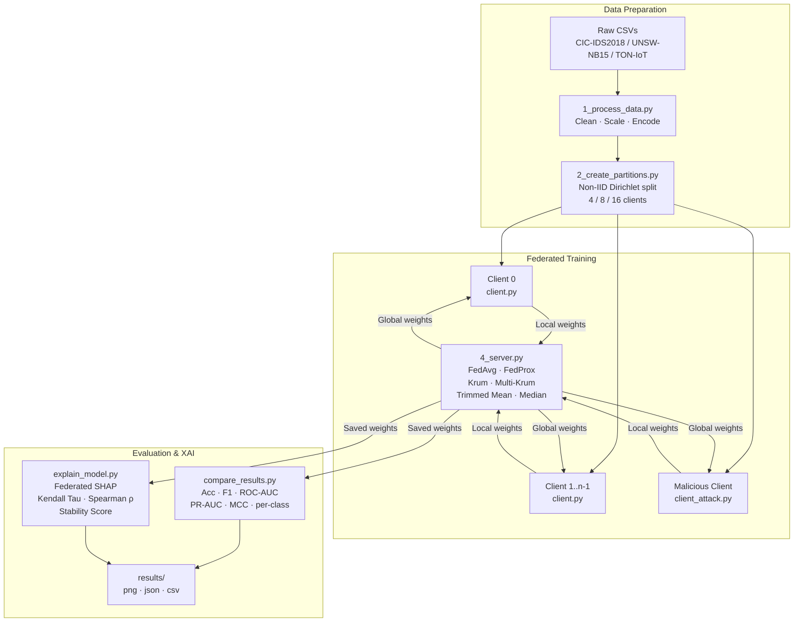

# FLEX-ID: Federated Learning Explainable Intrusion Detection System

> **Publication-quality research framework for privacy-preserving, robust, and explainable network intrusion detection using federated learning.**

---

## Abstract

FLEX-ID is a federated learning (FL) framework for network intrusion detection that jointly addresses **privacy**, **robustness**, and **explainability** — three requirements that are rarely tackled together in the existing literature. Clients (network nodes) collaboratively train a Deep Neural Network (DNN) classifier without sharing raw traffic data. The server aggregates model updates using configurable algorithms ranging from standard FedAvg to Byzantine-robust methods (Krum, Trimmed Mean, Coordinate Median). A federated SHAP module explains *why* the model flags traffic as malicious while ensuring that per-sample explanations never leave the client.

---

## Key Contributions

| # | Contribution | Where |
|---|---|---|
| 1 | **5-attack adversarial benchmark** — label flipping, Gaussian noise, backdoor, Byzantine/model-replacement, and adaptive (constrain-and-scale) poisoning | `ml/client_attack.py` |
| 2 | **4 robust aggregation algorithms** — Krum, Multi-Krum, Trimmed Mean, Coordinate Median — selectable at runtime alongside FedAvg/FedProx | `ml/aggregation.py`, `ml/4_server.py` |
| 3 | **Privacy-preserving federated SHAP** — only aggregated importance vectors leave clients; Kendall's Tau and Spearman's ρ quantify explanation consistency | `ml/explain_model.py` |
| 4 | **Scalable client architecture** — 4 / 8 / 16 clients via a single CLI flag | `ml/2_create_partitions.py`, `ml/4_server.py` |
| 5 | **Cross-dataset preprocessing pipeline** — ready-to-use scripts for UNSW-NB15 and TON-IoT with identical feature schema | `ml/prepare_unswnb15.py`, `ml/prepare_toniot.py` |
| 6 | **Comprehensive evaluation suite** — Accuracy, Balanced Accuracy, Macro/Weighted F1, ROC-AUC, PR-AUC, MCC, per-class metrics, inference time, communication cost | `ml/compare_results.py` |

---

## System Architecture



---

## Project Structure

```
Flex-ID/
├── ml/
│   ├── 1_process_data.py          # CIC-IDS2018 preprocessing
│   ├── 2_create_partitions.py     # Non-IID client partitioning (4/8/16 clients)
│   ├── 4_server.py                # FL server with 6 aggregation strategies
│   ├── client.py                  # Honest federated client
│   ├── client_attack.py           # Malicious client (5 attack types)
│   ├── model.py                   # DNN architecture
│   ├── explain_model.py           # Federated SHAP explainability
│   ├── compare_results.py         # Full evaluation suite
│   ├── plot_history.py            # Learning curve plots + CSV export
│   ├── aggregation.py             # Krum / Multi-Krum / Trimmed Mean / Median
│   ├── prepare_unswnb15.py        # UNSW-NB15 preprocessing
│   ├── prepare_toniot.py          # TON-IoT preprocessing
│   └── utils/
│       ├── __init__.py
│       ├── seeds.py               # Global seed management
│       └── data_utils.py          # Shared data-loading helpers
├── backend/                       # Node.js REST API
├── frontend/                      # React dashboard
├── docs/
│   ├── ATTACK_GUIDE.md
│   ├── DATASET_GUIDE.md
│   ├── TRAINING_GUIDE.md
│   └── EVALUATION_GUIDE.md
├── data/                          # Processed data (gitignored)
├── results/                       # Output artefacts (gitignored)
├── requirements.txt
└── README.md
```

---

## Installation

```bash
git clone https://github.com/Raghu9855/Flex-ID.git
cd Flex-ID
pip install -r requirements.txt
```

**Dependencies:** `flwr`, `tensorflow`, `scikit-learn`, `imbalanced-learn`,
`shap`, `scipy`, `pandas`, `numpy`, `matplotlib`, `seaborn`

---

## Step-by-Step Execution

### Step 1 — Data Preprocessing

```bash
cd ml
python 1_process_data.py
```

*Input:* `data/combined_ids2018_raw.csv`  
*Output:* `data/processed_data.csv`

### Step 2 — Create Client Partitions

```bash
# 4 clients (default)
python 2_create_partitions.py

# 8 clients
python 2_create_partitions.py --num_clients 8

# 16 clients
python 2_create_partitions.py --num_clients 16
```

*Output:* `data/client_partition_0.pkl` … `data/client_partition_{n-1}.pkl`

### Step 3 — Start the Server

```bash
# FedAvg
python 4_server.py --strategy fedavg --rounds 30 --num_clients 4

# FedProx (μ = 0.1)
python 4_server.py --strategy fedprox --rounds 30 --proximal_mu 0.1

# Krum (Byzantine-robust, 1 assumed Byzantine client)
python 4_server.py --aggregation krum --rounds 30 --num_clients 8 --num_byzantine 1

# Multi-Krum
python 4_server.py --aggregation multikrum --rounds 30 --num_clients 8

# Trimmed Mean (trim 25% per tail)
python 4_server.py --aggregation trimmed_mean --trim_ratio 0.25 --num_clients 8

# Coordinate Median
python 4_server.py --aggregation median --rounds 30 --num_clients 16
```

### Step 4 — Start Clients

Open **N separate terminals** (one per client):

```bash
# Terminal 0
python client.py --cid 0

# Terminal 1
python client.py --cid 1

# ... up to --cid N-1
```

### Step 5 — Adversarial Evaluation

Replace one or more clients with a malicious client:

```bash
# Label Flipping — flip 100% of labels to Benign
python client_attack.py --cid 0 --attack_type flip --scale 1.0

# Gaussian Noise — add noise (std=0.5) to weights
python client_attack.py --cid 0 --attack_type noise --scale 0.5

# Backdoor — trigger on feature 5, poison 30% of attack samples
python client_attack.py --cid 0 --attack_type backdoor --scale 0.3 \
    --trigger_feature_idx 5 --trigger_value 999.0

# Byzantine / Model Replacement — amplify update by 10×
python client_attack.py --cid 0 --attack_type byzantine --scale 10.0

# Adaptive (Constrain-and-Scale) — 20 gradient ascent steps
python client_attack.py --cid 0 --attack_type adaptive --scale 2.0
```

### Step 6 — Evaluate

```bash
python compare_results.py \
    --fedavg  results/fedavgeachround/round-30-weights.pkl \
    --fedprox results/fedproxeachround/round-30-weights.pkl \
    --mode    no_attack
```

### Step 7 — Explainability

```bash
# Explain round 30, 4 clients, 100 background samples
python explain_model.py --round 30 --num_clients 4 --bg_size 100 --explain_size 50
```

*Output:* `results/*_shap.png`, `results/shap_summary.json`

### Step 8 — Learning Curves

```bash
python plot_history.py
```

*Output:* `results/comparison_metrics.png`, `results/round_metrics_*.csv`

---

## Attack Reference

| Attack | `--attack_type` | Mechanism | Scale Meaning |
|---|---|---|---|
| Label Flipping | `flip` | Relabels attack traffic as Benign | Fraction of samples flipped (0–1) |
| Gaussian Noise | `noise` | Adds N(0, σ) to model weights | Noise std deviation σ |
| Backdoor | `backdoor` | Stamps a feature trigger; poisons label to Benign | Fraction of attack samples poisoned |
| Byzantine | `byzantine` | Amplifies weight update delta by scale factor | Amplification multiplier |
| Adaptive | `adaptive` | Gradient ascent + constrain-and-scale clipping | Steps = scale × 10 |

---

## Aggregation Reference

| Strategy | `--aggregation` | Robustness | Requirement |
|---|---|---|---|
| FedAvg | `fedavg` | None | — |
| FedProx | `fedprox` | Non-IID drift | `--proximal_mu` |
| Krum | `krum` | Byzantine | n ≥ 2f+3 (⚠ fails at n=4, f=1) |
| Multi-Krum | `multikrum` | Byzantine | n ≥ 2f+3 recommended |
| Trimmed Mean | `trimmed_mean` | Byzantine | `--trim_ratio` |
| Coord. Median | `median` | Byzantine | — |

> **Note on FedProx:** FedProx adds a *proximal regularisation term* (μ/2 · ‖w − w_global‖²) to each client's local objective to reduce model drift under non-IID data heterogeneity. It is **not** a Byzantine-robust aggregation rule. Byzantine robustness requires Krum, Trimmed Mean, or Coordinate Median.

---

## Performance Results (CIC-IDS2018, 4 clients, 30 rounds)

| Scenario | Strategy | Accuracy | Weighted F1 | Macro F1 | Notes |
|---|---|---|---|---|---|
| No Attack | FedAvg | 88.40% | 0.86 | — | Baseline |
| No Attack | **FedProx** | **88.81%** | **0.89** | — | Best clean |
| Under Attack | FedAvg | 76.29% | 0.67 | — | Significant drop |
| Under Attack | **FedProx** | **89.11%** | **0.89** | — | Resilient |

> Attacks tested: label-flipping (Client 0, 100% flip ratio) and Gaussian noise (std=0.5).

---

## Multi-Dataset Support

```bash
# UNSW-NB15
python prepare_unswnb15.py --input_dir data_unswnb15/raw --output_dir data_unswnb15
python 2_create_partitions.py --data_dir data_unswnb15 --num_clients 4
python 4_server.py --strategy fedavg --data_dir data_unswnb15

# TON-IoT
python prepare_toniot.py --input_dir data_toniot/raw --output_dir data_toniot
python 2_create_partitions.py --data_dir data_toniot --num_clients 4
python 4_server.py --strategy fedavg --data_dir data_toniot
```

Download datasets:
- UNSW-NB15: https://research.unsw.edu.au/projects/unsw-nb15-dataset
- TON-IoT: https://research.unsw.edu.au/projects/toniot-datasets

---

## Reproducibility

All experiments use **seed = 42** applied globally to:
- Python `random`
- `numpy.random`
- `tensorflow.random`
- OS hash seed (`PYTHONHASHSEED`)

```python
from utils.seeds import set_global_seeds
set_global_seeds(42)
```

---

## References

1. McMahan, H. B., Moore, E., Ramage, D., Hampson, S., & Agüera y Arcas, B. (2017). Communication-efficient learning of deep networks from decentralized data. *AISTATS*, 54, 1273–1282.

2. Li, T., Sahu, A. K., Zaheer, M., Sanjabi, M., Talwalkar, A., & Smith, V. (2020). Federated optimization in heterogeneous networks. *MLSys*, 3.

3. Lundberg, S. M., & Lee, S.-I. (2017). A unified approach to interpreting model predictions. *NeurIPS*, 30, 4765–4774.

4. Blanchard, P., Guerraoui, R., Stainer, J., et al. (2017). Machine learning with adversaries: Byzantine tolerant gradient descent. *NeurIPS*, 30.

5. Yin, D., Chen, Y., Kannan, R., & Bartlett, P. (2018). Byzantine-robust distributed learning: Towards optimal statistical rates. *ICML*, 80, 5650–5659.

6. Sharafaldin, I., Habibi Lashkari, A., & Ghorbani, A. A. (2018). Toward generating a new intrusion detection dataset and intrusion traffic characterization. *ICISSP*, 108–116.

7. Bagdasaryan, E., Veit, A., Hua, Y., Estrin, D., & Shmatikoff, V. (2020). How to backdoor federated learning. *AISTATS*, 108, 2938–2948.

8. Moustafa, N., & Slay, J. (2015). UNSW-NB15: A comprehensive data set for network intrusion detection systems. *MilCIS*.

9. Alsaedi, A., Moustafa, N., Tari, Z., Mahmood, A., & Anwar, A. (2020). TON_IoT telemetry dataset. *IEEE Access*, 8, 165130–165150.

---

## Notes

- Large data files (`*.csv`) are stored via **Git LFS**.
- Generated artefacts (`*.pkl`, `*.png`, `results/`) are excluded via `.gitignore`.
- Run all `ml/` scripts from inside the `ml/` directory so relative paths resolve correctly.
